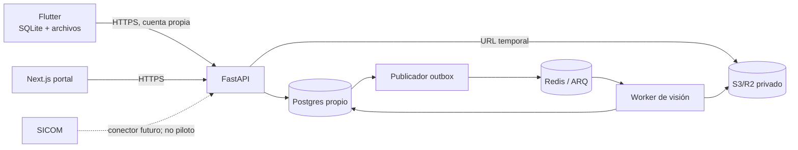

# Arquitectura de referencia

## Límites y componentes

El monorepo inicia el portal Next.js y el esqueleto Flutter. FastAPI, worker y despliegue se implementarán en el siguiente recorrido vertical; no hay API fingida detrás de la interfaz actual.

## Carga y procesamiento

1. Flutter crea UUID y conserva imagen/metadatos (`captured_at`) localmente.
2. `POST /v1/captures` registra idempotentemente en el tenant y devuelve instrucciones de carga temporal.
3. Cliente sube al objeto asignado y confirma hash/tamaño. La API verifica propietario y objeto.
4. En una transacción, cambia estado y agrega un `analysis_outbox` único. Un publicador reintentable envía a ARQ; un conciliador recupera pendientes.
5. El worker reclama un `analysis_job` único, descarga, evalúa calidad, ejecuta pipeline y escribe una nueva versión de resultado. Los reintentos no suman conteos.
6. Portal/app consultan estados; una revisión crea un evento inmutable y una proyección vigente.

No se confía en nombres de objeto enviados por el cliente. No existe transacción distribuida Postgres–Redis. R2 Events/Queues queda como alternativa, no como segunda cola simultánea.

## Modelo conceptual

Todas las entidades de negocio llevan `tenant_id`. IDs UUID/ULID propios; `external_system`/`external_id` son equivalencias opcionales.

* identidad: `tenant`, `user`, `membership`, `store`, `store_access`;
* catálogo: `category`, `catalog_version`, `sku`, `package_variant`, `visual_reference`;
* captura: `capture`, `capture_asset`, `analysis_outbox`, `analysis_job`;
* visión: `model_version`, `analysis_result`, `detection`, `sku_candidate`, `result_summary`;
* humano: `review`, `review_change`, `validated_annotation`;
* futuro: `expected_assortment`, `external_reference`.

Restricciones únicas propuestas: `(tenant_id, device_capture_id)`, `capture_asset.object_key`, `(capture_id, pipeline_version)`, clave de outbox y clave idempotente de revisión. Las fechas `captured_at`, `uploaded_at`, `processed_at` son distintas.

## Contrato inicial de estados

`saved_local → pending_upload → uploaded → queued → processing → needs_review | completed`; desde carga/proceso puede pasar a `recoverable_error` y reintentarse. El servidor no conoce `saved_local`. Las transiciones inválidas responden conflicto, no crean otro registro.

## Decisiones y evaluaciones abiertas

| Decidido | Por evaluar con evidencia |
|---|---|
| Producto, identidad, DB y almacenamiento propios. | S3 vs R2, región, retención y costos. |
| Next.js + Flutter; FastAPI/Postgres; análisis separado. | Proveedor de identidad y mecanismo de sesión. |
| Redis/ARQ como primera cola y outbox recuperable. | Detector, embeddings/clasificador, OCR y licencias. |
| Inferencia en servidor; objetos privados. | CPU/GPU/servicio administrado según benchmark real. |
| Tenant desde el diseño; piloto de uno. | Umbrales calibrados, hardware y SLO finales. |

## Seguridad, observabilidad y pruebas

Autorización por tenant en cada consulta, URLs firmadas cortas, secretos sólo en servidor, validación MIME/tamaño/hash y análisis de archivos. Logs estructurados usan `capture_id/job_id`, sin URLs firmadas. Pruebas mínimas: aislamiento entre tenants, idempotencia concurrente, expiración URL, caída entre commit/publicación, reintento de worker y revisión concurrente.

